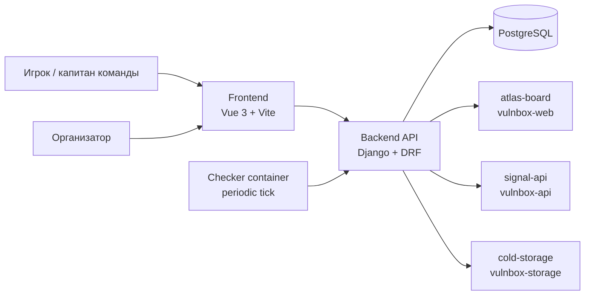
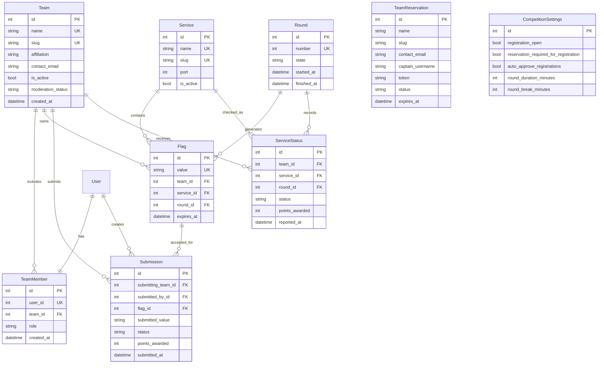
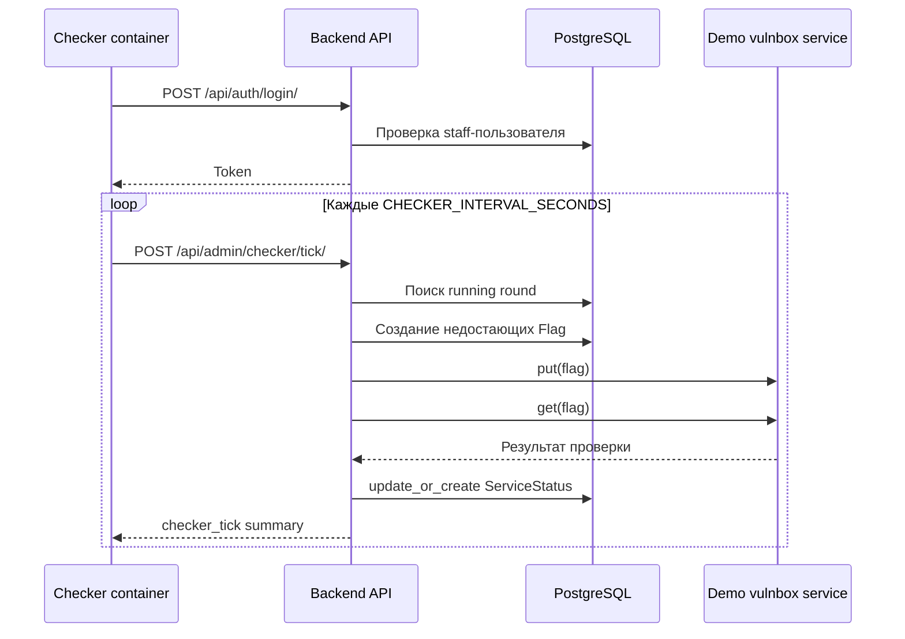

# ПРИЛОЖЕНИЕ Б. Заготовки схем и рисунков

В этом приложении собраны черновые схемы, которые можно использовать при финальной верстке ВКР. В Markdown они оформлены как Mermaid-диаграммы. При переносе в `.docx` их можно экспортировать в изображения и подписать в соответствии с требованиями методических указаний.

## Рисунок 2.1 — Общая архитектура платформы `baltctf`

К схеме следует добавить подпись: "Рисунок 2.1 — Общая архитектура платформы `baltctf`". На рисунке важно показать, что frontend не работает с базой данных напрямую, checker вызывает только backend API, а backend является центральной доверенной частью системы.

## Рисунок 2.2 — ER-диаграмма основных сущностей

`TeamReservation` и `CompetitionSettings` показаны как отдельные сущности, потому что они участвуют в регистрационном и административном сценариях, но не образуют внешних ключей с игровыми таблицами. На финальной схеме рядом с диаграммой следует указать ограничения уникальности: `Team.name`, `Team.slug`, `Service.name`, `Service.slug`, `Round.number`, `Flag.value`, `TeamReservation.name`, `TeamReservation.slug`, `TeamReservation.token`, а также составные ограничения `Flag(team, service, round)` и `ServiceStatus(team, service, round)`.

## Рисунок 3.1 — Поток выполнения checker tick

Для главы 3 эту схему можно использовать рядом с описанием checker system. Она показывает, что внешний checker-контейнер инициирует цикл, но доменная логика генерации флагов, выбора сервисных checker modules и записи `ServiceStatus` находится на стороне backend-а.
