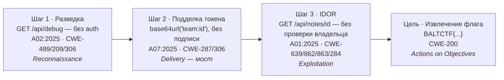

# Уязвимый сервис `notes` (Team Notes)

Учебная цель формата **Attack/Defense** для платформы `baltctf`. Веб‑приложение
командных заметок: каждая команда ведёт набор приватных записей, доступ к которым
в штатном режиме имеет только эта команда. В отличие от прежних демонстрационных
сервисов с одиночными ошибками, `notes` качественно реализует **полную цепочку из
трёх связанных уязвимостей** — от разведки до извлечения флага.

В каждом раунде checker‑система, действуя как легитимный пользователь своей
команды, создаёт приватную запись с флагом `BALTCTF{...}` (операция `put`) и тут же
читает её штатным авторизованным способом (операция `get`). Успех обеих операций →
статус сервиса **`up`** и защитные баллы. Флаг при этом достижим атакующей командой
**только по уязвимому пути** и недоступен через штатный интерфейс — именно это
делает действия участников однозначно оцениваемыми.

---

## 1. Роль в платформе и два пути доступа

В сервисе намеренно сосуществуют два пути к данным:

* **Штатный путь** (checker‑система и легитимная команда): аутентификация командным
  ключом → выдача токена → работа только со своими записями. Обеспечивает контроль
  доступности (`up`/`down`) и начисление **защитных** баллов.
* **Уязвимый путь** (атакующая команда): разведка → подделка токена → IDOR → чтение
  чужой записи с флагом. Обеспечивает **атакующие** баллы.

Флаг достижим только по второму пути. Конфиденциальность флага соответствует
атакующей составляющей результата, доступность сервиса — защитной.

---

## 2. Архитектура и модель данных

Хранение — компактная реляционная база **SQLite** (`notes.db`). Идентификатор
записи целочисленный и присваивается **последовательно** (`INTEGER PRIMARY KEY
AUTOINCREMENT`). Последовательный id выбран осознанно: он соответствует
распространённому в реальных приложениях шаблону и делает учебную уязвимость (IDOR)
наблюдаемой и воспроизводимой.

```sql
CREATE TABLE teams (
    id         INTEGER PRIMARY KEY AUTOINCREMENT,
    slug       TEXT UNIQUE NOT NULL,
    auth_key   TEXT NOT NULL,
    created_at TEXT NOT NULL
);
CREATE TABLE notes (
    id         INTEGER PRIMARY KEY AUTOINCREMENT,   -- ← цель перебора (IDOR)
    team_id    INTEGER NOT NULL,                    -- владелец записи
    title      TEXT NOT NULL,
    body       TEXT NOT NULL,                       -- здесь лежит флаг
    created_at TEXT NOT NULL,
    FOREIGN KEY (team_id) REFERENCES teams (id)
);
```

### API

| Метод | Маршрут | Аутентификация | Назначение |
|---|---|---|---|
| `GET`  | `/api/status` | нет | Баннер сервиса |
| `POST` | `/api/session` | командный ключ | Выдать сессионный токен команды |
| `POST` | `/api/notes` | токен | Создать запись |
| `GET`  | `/api/notes` | токен | Список **своих** записей (штатный, защищённый) |
| `GET`  | `/api/notes/<id>` | токен | Чтение записи по id (**IDOR**; его же использует checker) |
| `GET`  | `/api/debug` | **нет** | Диагностика (**оставленный отладочный маршрут**) |

---

## 3. Штатный путь checker‑системы (контракт `put`/`get`)

Checker знает командный ключ своей команды (детерминированно выводимый секрет) и
выполняет три запроса:

```bash
# 1. session: получить сессионный токен
curl -s -X POST http://localhost:8084/api/session \
  -H 'Content-Type: application/json' \
  -d '{"team":"northern-lights","key":"<team-key>"}'
# -> {"team_id":1,"token":"dGVhbTox"}

# 2. put: разместить флаг в приватной записи
curl -s -X POST http://localhost:8084/api/notes \
  -H 'Authorization: Bearer dGVhbTox' -H 'Content-Type: application/json' \
  -d '{"title":"round-1 flag","body":"BALTCTF{...}"}'
# -> {"ok":true,"note":{"id":1,"team_id":1,...}}

# 3. get: штатно прочитать ту же запись по id и сверить флаг
curl -s http://localhost:8084/api/notes/1 -H 'Authorization: Bearer dGVhbTox'
# -> {"note":{"id":1,"team_id":1,"body":"BALTCTF{...}",...}}
```

Если оба шага успешны и флаг возвращается без искажений — сервис `up`. Недоступность
→ `down`, неверный HTTP‑статус → `mumble`, искажение/отсутствие флага → `corrupt`
(в терминах доменной модели платформы).

Готовый модуль checker‑а для платформы (`backend/ctf/checkers/notes.py`,
по желанию — интеграция не входила в обязательную поставку) приведён в
[разделе 8](#8-интеграция-в-платформу-опционально).

---

## 4. Цепочка уязвимостей (bug chaining)

Отдельные слабости связаны так, что результат эксплуатации одной становится
предпосылкой следующей. Цепочка из трёх шагов завершается извлечением флага.



**Рис. 3. Схема цепочки уязвимостей сервиса `notes`.**

### Шаг 1. Разведка через небезопасную конфигурацию

`A02:2025 — Security Misconfiguration` · `CWE-489` (оставленный отладочный код),
`CWE-209` (раскрытие сведений в сообщении об ошибке), `CWE-306` (отсутствие
аутентификации для критической функции). Этап Cyber Kill Chain — **разведка**.

Сервис развёрнут с включённым отладочным режимом. Доступный без авторизации маршрут
`/api/debug` и подробные трассировки раскрывают внутренние детали: последовательную
природу id, наличие маршрута прямого чтения и **схему токена с живым примером**.

```jsonc
// GET /api/debug   (без какой-либо аутентификации)
{
  "token_scheme": "base64url('team:<team_id>')  # UNSIGNED — forgeable, do not ship",
  "token_example": { "team_id": 1, "slug": "northern-lights",
                     "decoded": "team:1", "token": "dGVhbTox" },
  "notes_id_sequence": { "type": "sequential integer (INTEGER PRIMARY KEY AUTOINCREMENT)",
                         "count": 1, "min_id": 1, "max_id": 1 },
  "routes": ["/", "/api/debug", "/api/notes", "/api/notes/<int:note_id>",
             "/api/session", "/api/status"],
  "hint": "GET /api/notes/<id> fetches a note by its global sequential id."
}
```

Сама по себе разведка доступа к флагу не даёт, но формирует «карту» для следующих
шагов.

### Шаг 2. Подмена командного контекста при слабой аутентификации

`A07:2025 — Authentication Failures` · `CWE-287` (некорректная аутентификация),
`CWE-306`. Этап Cyber Kill Chain — **доставка** (мост от разведки к доступу).

Сессионный токен **не подписан** и представляет собой обратимое кодирование
идентификатора команды — `base64url("team:<id>")`. Зная схему (шаг 1), участник
формирует токен от имени другой команды **полностью на стороне клиента**, без какого
‑либо секрета:

```bash
python3 -c "import base64; print(base64.urlsafe_b64encode(b'team:2').decode())"
# dGVhbToy        ← валидный токен «команды 2»
```

Командный ключ в `/api/session` закрывает возможность *получить* чужой токен
легитимно, но не мешает его *подделать* — в этом и состоит слабость.

### Шаг 3. Нарушение контроля доступа (IDOR)

`A01:2025 — Broken Access Control` · `CWE-639` (обход авторизации через управляемый
пользователем ключ), `CWE-862` (отсутствие авторизации), `CWE-863` (некорректная
авторизация), `CWE-284` (некорректный контроль доступа). Этап Cyber Kill Chain —
**эксплуатация**.

Маршрут `GET /api/notes/<id>` использует переданный id напрямую и **не проверяет**,
принадлежит ли запись запрашивающей команде. Перебирая последовательные id с
подделанным токеном, участник читает произвольные записи — горизонтальное повышение
привилегий (типовой сценарий PortSwigger Web Security Academy).

```bash
curl -s http://localhost:8084/api/notes/1 -H 'Authorization: Bearer dGVhbToy'
# {"note":{"id":1,"team_id":1,"title":"round-1 flag","body":"BALTCTF{...}",...}}
#                  ↑ запрошено токеном team 2, но возвращена запись team 1
```

### Достижение цели

`CWE-200` (раскрытие чувствительной информации). Этап Cyber Kill Chain — **достижение
цели / извлечение данных**. Полученная чужая запись содержит флаг checker‑системы;
участник извлекает его и отправляет в backend платформы через интерфейс отправки
флагов, получая атакующие баллы.

### Сводная таблица

| Шаг | OWASP Top 10:2025 | CWE | Cyber Kill Chain |
|---|---|---|---|
| 1. Разведка | A02:2025 — Security Misconfiguration (№2) | CWE‑489, CWE‑209, CWE‑306 | Reconnaissance |
| 2. Подделка токена | A07:2025 — Authentication Failures | CWE‑287, CWE‑306 | Delivery (мост) |
| 3. IDOR | A01:2025 — Broken Access Control (№1) | CWE‑639, CWE‑862, CWE‑863, CWE‑284 | Exploitation |
| Цель | — | CWE‑200 | Actions on Objectives |

> Выбор класса уязвимостей опирается на актуальные отраслевые перечни: в OWASP Top
> 10:2025 нарушение контроля доступа сохраняет 1‑е место, а небезопасная
> конфигурация поднялась с 5‑го (2021) на 2‑е место; в MITRE «2025 CWE Top 25»
> значительную долю составляют ошибки контроля доступа и раскрытия данных.

---

## 5. Почему флаг недоступен по штатному пути

Маршрут `GET /api/notes` (список) строго фильтрует выборку по `team_id` вызывающей
команды. Под подделанным токеном «команды 2» список пуст — флаг команды 1 в нём не
виден:

```bash
curl -s http://localhost:8084/api/notes -H 'Authorization: Bearer dGVhbToy'
# {"team_id":2,"notes":[]}
```

Флаг отдаётся исключительно уязвимым маршрутом `GET /api/notes/<id>` при отсутствии
проверки владельца. Это и есть разделение, на котором держится оценивание.

---

## 6. Исправление (защита от IDOR)

В формате A/D защищающаяся команда устраняет уязвимость **прямо во время игры**,
добавляя серверную проверку принадлежности записи — рекомендуемую меру против IDOR.
Достаточно двух строк в `get_note()`:

```diff
     if row is None:
         return error(404, "note not found")
+    # Фикс IDOR: запись отдаётся только её владельцу.
+    if row["team_id"] != team["id"]:
+        return error(403, "you do not own this note")
     return {"note": dict(row)}
```

Для демонстрации тот же фикс включается переключателем окружения **без правки кода**:

```bash
NOTES_SECURE=1 python app.py      # IDOR закрыт
```

**Ключевое свойство:** фикс закрывает уязвимый путь, но не ломает checker. Проверено
сквозным прогоном:

| Состояние | checker (`put`+`get` своей записи) | эксплойт (чужая запись по id) |
|---|---|---|
| `NOTES_SECURE=0` (уязвимо) | `up` ✅ | флаг утекает (`200`) ✅ |
| `NOTES_SECURE=1` (фикс) | `up` ✅ | заблокировано (`403`) ⛔ |

Checker читает **свою** запись своим токеном (`row.team_id == team.id`), поэтому
проверка владельца его пропускает; кросс‑командное чтение — отклоняет. Если бы
устранение уязвимости ломало штатную проверку, защита конфликтовала бы с
доступностью, что противоречит логике формата.

> **Защита в глубину.** Проверка владельца закрывает канонический кросс‑командный
> IDOR (шаг 3). Остаточный вектор — подделка токена именно команды‑жертвы (шаг 2) —
> устраняется **подписью токена** (например, HMAC/JWT) как дополнительной мерой.
> Рекомендуемым «ключевым» фиксом в рамках раунда остаётся проверка владельца.

---

## 7. Конфигурация и запуск

| Переменная | По умолчанию | Назначение |
|---|---|---|
| `NOTES_DEBUG` | `1` | Отладочный режим: маршрут `/api/debug` и трассировки в ответах (шаг 1). `0` — выключить разведку |
| `NOTES_SECURE` | `0` | `1` — серверная проверка владельца записи (фикс IDOR, шаг 3) |
| `NOTES_DB_PATH` | `./notes.db` | Путь к файлу SQLite |
| `NOTES_HOST` / `NOTES_PORT` | `0.0.0.0` / `8080` | Адрес прослушивания |
| `NOTES_CORS` | `1` | CORS для браузерного веб‑клиента (`Access-Control-Allow-Origin: *`). `0` — выключить |

```bash
# Локально
pip install flask==3.1.0
python app.py

# В Docker (уязвимое состояние по умолчанию)
docker build -t notes-service .
docker run -p 8084:8080 notes-service
```

---

## 8. Веб‑клиент (`ui/notes-client.html`)

Самодостаточный браузерный клиент **штатного** пути сервиса: вход по команде,
создание, список и чтение собственных заметок. Один HTML‑файл без внешних
зависимостей и без сборки — работает офлайн, удобно для демонстрации на защите.

Запуск:

1. Поднять сервис: `python app.py` (или Docker). По умолчанию включён `NOTES_CORS=1`,
   поэтому браузер может обращаться к API из файла, открытого локально.
2. Открыть `ui/notes-client.html` двойным щелчком (через `file://`).
3. Указать **Service URL** (по умолчанию `http://localhost:8084`), ввести команду и
   командный ключ → войти. Первый вход регистрирует команду с этим ключом.

Клиент использует только штатные маршруты (`/api/session`, `/api/notes`,
`/api/notes/<id>` со своим токеном) и не демонстрирует уязвимости — это интерфейс
легитимного пользователя, а не атакующего.

---

## 9. Интеграция в платформу (опционально)

Готовые фрагменты, если потребуется подключить `notes` как боевой сервис рядом с
существующими прототипами `atlas-board` / `signal-api` / `cold-storage`.

**`docker-compose.yml`** — новый сервис и адрес для backend:

```yaml
  vulnbox-notes:
    build:
      context: ./vulnbox/notes-service
    ports:
      - "8084:8080"
```
```yaml
  # backend.environment:
  NOTES_BASE_URL: ${NOTES_BASE_URL:-http://vulnbox-notes:8080}
```

**`backend/ctf/management/commands/seed_demo_data.py`** — `SERVICE_FIXTURES`:

```python
{
    "name": "Team Notes",
    "slug": "notes",
    "description": "SQLite notes service with a full recon→auth→IDOR chain.",
    "port": 8084,
},
```

**`backend/ctf/checkers/notes.py`** — модуль checker‑а (сигнатура как у остальных):

```python
from __future__ import annotations

import hashlib

from .base import CheckerCorruptError, build_url, ensure_status_code, read_base_url

BASE_URL = read_base_url("NOTES_BASE_URL", "http://localhost:8084")
# Секрет известен только checker-системе; в проде — из окружения.
REGISTRATION_SECRET = "baltctf-notes-checker"


def _team_key(team_slug: str) -> str:
    return hashlib.sha256(f"{team_slug}:{REGISTRATION_SECRET}".encode()).hexdigest()


def run(*, session, team, flag, round_obj, timeout_seconds: float) -> str:
    login = session.post(
        build_url(BASE_URL, "/api/session"),
        json={"team": team.slug, "key": _team_key(team.slug)},
        timeout=timeout_seconds,
    )
    ensure_status_code(login, {200}, message=f"notes: session failed for {team.slug}")
    headers = {"Authorization": f"Bearer {login.json()['token']}"}

    created = session.post(
        build_url(BASE_URL, "/api/notes"),
        json={"title": f"round-{round_obj.number} flag", "body": flag.value},
        headers=headers,
        timeout=timeout_seconds,
    )
    ensure_status_code(created, {200, 201}, message=f"notes: rejected flag placement for {team.slug}")
    note_id = created.json()["note"]["id"]

    fetched = session.get(
        build_url(BASE_URL, f"/api/notes/{note_id}"),
        headers=headers,
        timeout=timeout_seconds,
    )
    ensure_status_code(fetched, {200}, message=f"notes: could not read back note for {team.slug}")
    if ((fetched.json().get("note") or {}).get("body") or "").strip() != flag.value:
        raise CheckerCorruptError("notes: returned a note, but the stored flag mismatched.")
    return f"notes: stored and read back the round flag for {team.slug}."
```

**`backend/ctf/checkers/services.py`** — регистрация:

```python
from . import atlas_board, cold_storage, notes, signal_api

SERVICE_CHECKERS = {
    "atlas-board": atlas_board.run,
    "signal-api": signal_api.run,
    "cold-storage": cold_storage.run,
    "notes": notes.run,
}
```

---

## 10. Соответствие требованиям формата A/D

1. **Два пути доступа.** Штатный путь (checker, чтение своих записей) и уязвимый путь
   (атакующие, чтение чужих). Флаг достижим только по второму.
2. **Устранимость без отказа checker‑а.** Проверка владельца закрывает IDOR, но
   оставляет рабочим размещение и чтение собственного флага → сервис остаётся `up`.
3. **Баланс конфиденциальности и доступности.** Флаг обновляется каждый раунд и
   недоступен атакующим до прохождения цепочки; сервис непрерывно обслуживает checker.
4. **Правдоподобность и решаемость.** Три шага отражают реальные классы ошибок OWASP/
   CWE, демонстрируют связь «разведка — эксплуатация — извлечение данных» и достижимы
   в пределах раунда.

---

## Источники

* [OWASP Top 10:2025](https://owasp.org/Top10/2025/) — A01 Broken Access Control (№1), A02 Security Misconfiguration (№2), A07 Authentication Failures.
* [CWE‑639](https://cwe.mitre.org/data/definitions/639.html), [CWE‑862](https://cwe.mitre.org/data/definitions/862.html), [CWE‑863](https://cwe.mitre.org/data/definitions/863.html), [CWE‑284](https://cwe.mitre.org/data/definitions/284.html), [CWE‑287](https://cwe.mitre.org/data/definitions/287.html), [CWE‑306](https://cwe.mitre.org/data/definitions/306.html), [CWE‑489](https://cwe.mitre.org/data/definitions/489.html), [CWE‑209](https://cwe.mitre.org/data/definitions/209.html), [CWE‑200](https://cwe.mitre.org/data/definitions/200.html) — MITRE CWE.
* [PortSwigger Web Security Academy — IDOR](https://portswigger.net/web-security/access-control/idor).
